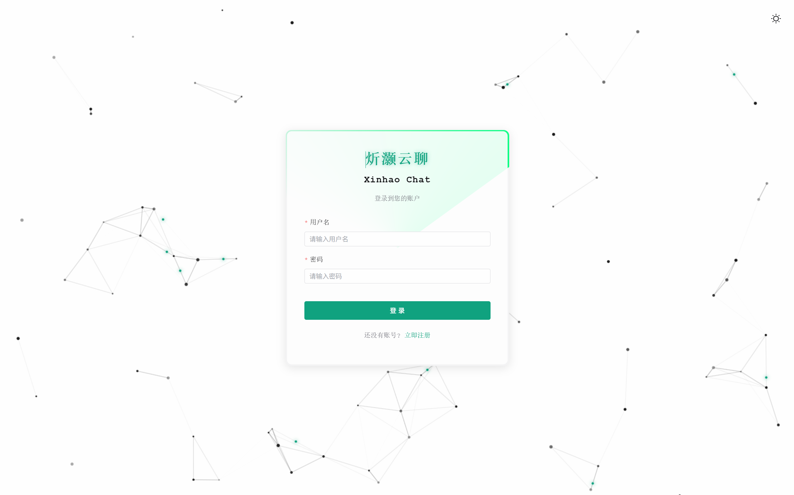
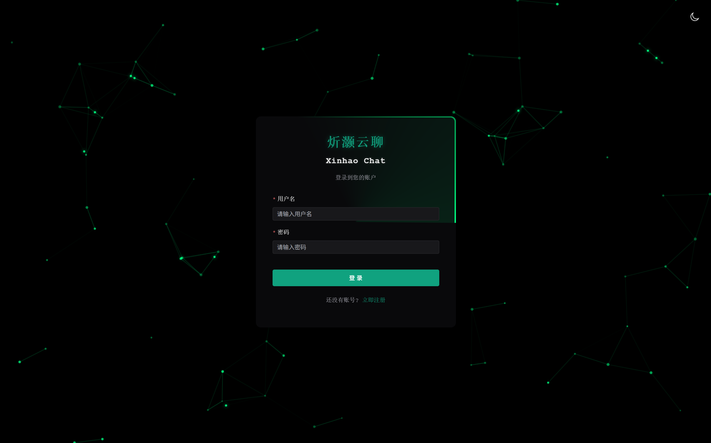
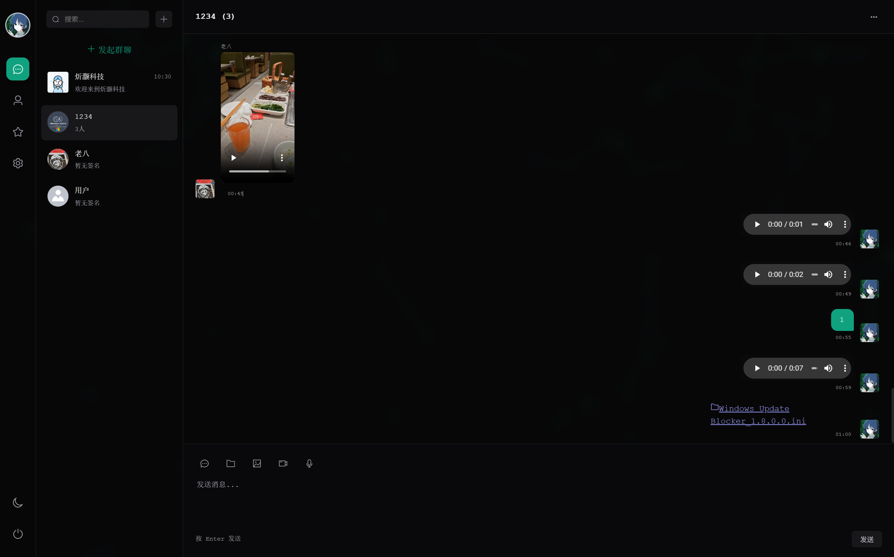
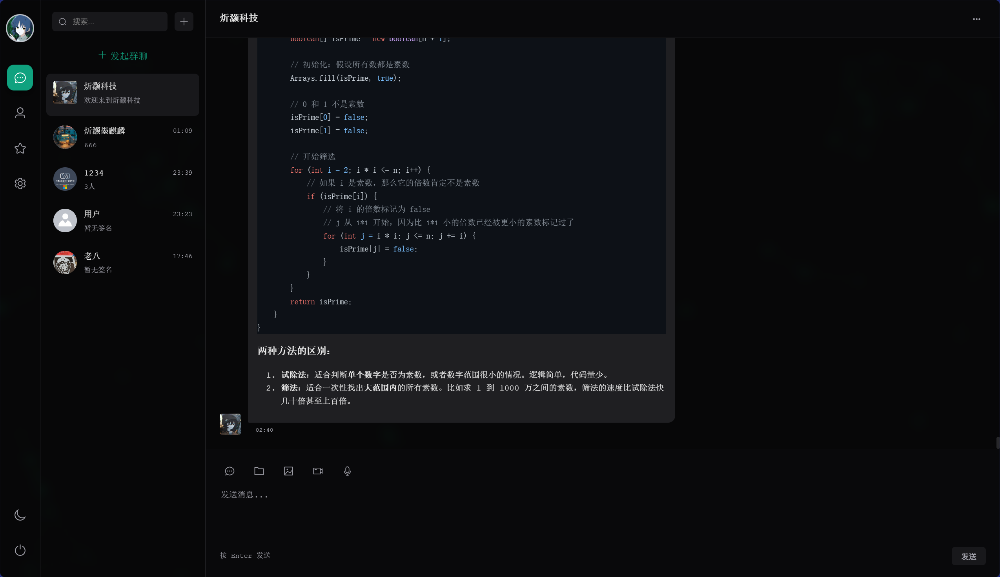
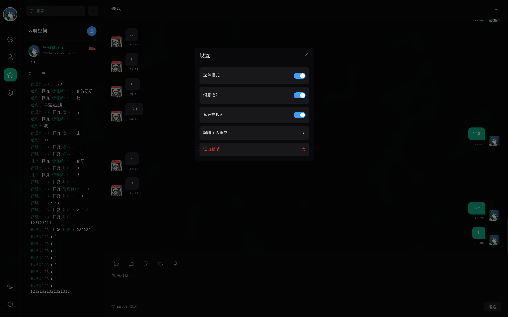
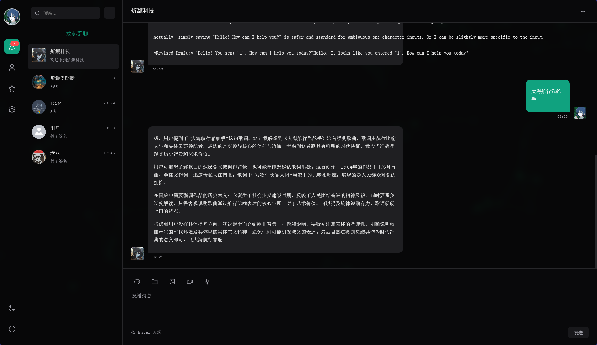

# XinhaoChat (炘灏云聊软件)

一个功能强大的全栈即时通讯系统，集成了私聊、群聊、朋友圈以及 AI 智能助手功能。

## 🌟 核心功能

### 1. 💬 即时通讯
- **实时消息**：基于 WebSocket (STOMP) 实现低延迟消息传输。
- **多媒体支持**：支持发送文字、图片、语音、视频、文件。
- **消息撤回**：支持 2 分钟内撤回消息，**群主可撤回群成员的任何消息**。
- **消息引用**：支持引用回复消息。
- **Markdown 支持**：聊天气泡支持 Markdown 渲染（代码高亮、列表、格式化文本），特别适合与 AI 交互。

### 2. 👥 好友与群组
- **好友管理**：搜索用户、发送/接受/拒绝好友请求。
- **群组管理**：
  - 创建群聊、邀请好友。
  - 群主权限：踢人、全员/个人禁言、修改群资料。
- **会话管理**：
  - **会话置顶**：右键置顶重要会话。
  - **智能排序**：置顶优先 > 最后活跃时间 > 创建时间。

### 3. 🤖 AI 智能助手
- 集成 **ModelScope (GLM-5)** 模型。
- 支持 **流式对话**（打字机效果）。
- 支持推理过程展示（Reasoning Content）。
- 自动识别代码块并进行高亮显示。

### 4. 朋友圈 (云聊空间)
- 发布图文动态。
- 点赞、评论互动。
- 实时通知提醒。

## 🛠️ 技术栈

### 后端 (Backend)
- **核心框架**: Spring Boot 3.2.3
- **数据库**: MySQL 8.0 + JPA (Hibernate)
- **安全**: Spring Security + JWT
- **通信**: WebSocket (STOMP) + OkHttp (SSE for AI)
- **构建**: Maven

### 前端 (Frontend)
- **核心框架**: Vue 3 + Vite
- **UI 组件库**: Element Plus
- **状态管理**: Pinia
- **路由**: Vue Router
- **工具库**: 
  - `markdown-it`: Markdown 渲染
  - `highlight.js`: 代码高亮
  - `stompjs`/`sockjs-client`: WebSocket 客户端

### 数据库
- **数据库**: MySQL 8.0+
- **数据库初始化**:
  1. 导入备份文件 `mysql.nb3` 初始化数据库结构。
  2. 系统会自动创建默认的 AI 助手账号（用户名：`ai_assistant`）。

## 🚀 快速启动

### 1. 环境要求
- JDK 17+
- Node.js 16+
- MySQL 8.0+

### 2. 后端启动
1. 进入后端目录：
   ```bash
   cd backend
   ```
2. 配置数据库：
   修改 `src/main/resources/application.yml` 中的数据库连接信息（url, username, password）。
3. 运行服务：
   ```bash
   mvn clean spring-boot:run
   ```
   后端默认运行在 `http://localhost:8080`。

### 3. 前端启动
1. 进入前端目录：
   ```bash
   cd frontend
   ```
2. 安装依赖：
   ```bash
   npm install
   ```
3. 启动开发服务器：
   ```bash
   npm run dev
   ```
   前端默认运行在 `http://localhost:5173`。

## 📂 项目结构

```
XinhaoChat/
├── backend/            # Spring Boot 后端源码
│   ├── src/main/java/com/xinhao/chat/
│   │   ├── controller/ # 控制器层
│   │   ├── service/    # 业务逻辑层
│   │   ├── repository/ # 数据访问层
│   │   ├── entity/     # 实体类
│   │   └── config/     # 配置类
│   └── src/main/resources/
│       └── application.yml # 配置文件
├── frontend/           # Vue 3 前端源码
│   ├── src/
│   │   ├── api/        # API 接口封装
│   │   ├── views/      # 页面组件
│   │   ├── components/ # 通用组件
│   │   ├── store/      # 状态管理
│   │   └── router/     # 路由配置
│   └── public/
└── example/            # 演示截图
```

## 📸 演示截图 (Screenshots)

<div align="center">
  
  
  
  
  
  
  
  
  
</div>
